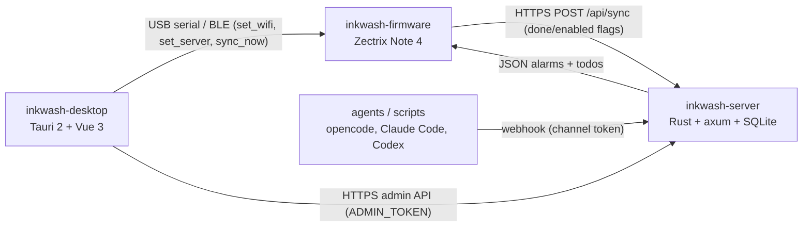

<div align="center">

# Inkwash

**A calm e-ink calendar, alarms & todos system for the Zectrix Note 4.**

Offline-first. Open source. Built for a 4.2″ e-paper ESP32-S3 notebook.

[](LICENSE)
[](https://github.com/counhopig/inkwash-firmware)
[](https://github.com/counhopig/inkwash-firmware)
[](https://github.com/counhopig/inkwash-server)
[](https://github.com/counhopig/inkwash-desktop)

</div>

---

## Why

The Note 4 is a notebook that's usually left on a desk, plugged in, and
ignored. Inkwash turns it into a device you *consult*: a clock, a
monthly calendar, and an alarms/todos board — all readable at a glance
on e-paper, all working **without a network**.

Alarms are stored on the device itself and rung by the RTC hardware, so a
fully-charged Note 4 wakes you up on time even with Wi-Fi off. Content
(alarms, todos) lives on your own server and is pulled as structured
JSON — the device renders it natively, it never shows server-rendered
images.

## Features

- **Offline-first alarms** — daily, weekly (specific weekdays), monthly
  (specific days) or one-shot schedules, rung by the PCF8563 hardware
  alarm with zero network dependency.
- **Interactive calendar** — month grid with due-today dots; pick any day
  to open a week view listing exactly what's due.
- **Todos with intent** — importance (low/med/high), due dates, repeat
  schedules, and a one-shot reminder for high-priority items.
- **Notification inbox** — external sources (webhooks, CI, agents) push
  messages to a device via the server; the device shows an unread badge and
  a full-screen alert for `alert`-kind items, and marks them read.
- **Agent-ready notifications** — an MCP server exposes the channel
  webhook, so opencode, Claude Code, Codex or any script can push a
  notification to the device (high-priority items ring the URGENT
  reminder within 30 s).
- **Self-hosted, personal-scale server** — one shared admin token, per
  device tokens, ETag caching, embedded admin console in a single binary.
- **Configure over USB or BLE** — no on-device text input; Wi-Fi, server
  and timezone are pushed from the desktop tool.
- **Cross-platform desktop app** — Tauri 2 + Vue 3 on Linux, macOS and
  Windows, with a headless CLI for scripting.
- **E-paper UI preview** — render every firmware screen to PNG from the
  real font/icon tables before flashing.

## Screens

Every screen below is rendered directly by the firmware's drawing code.

| Home | Calendar | Week view |
| --- | --- | --- |
|  |  |  |

| Alarms | Todos | Inbox |
| --- | --- | --- |
|  |  |  |

## Repositories

The project is split into four sibling repositories; this one is the
entry point.

| Repo | What it is | Stack |
| --- | --- | --- |
| [**inkwash-firmware**](https://github.com/counhopig/inkwash-firmware) | The Note 4 firmware — calendar, alarms, todos, sync, USB/BLE config | Rust · ESP-IDF · SSD2683 EPD · PCF8563 RTC |
| [**inkwash-server**](https://github.com/counhopig/inkwash-server) | Personal cloud backend — per-device alarms/todos, sync endpoint, admin UI | Rust · axum · SQLite · Vue 3 |
| [**inkwash-desktop**](https://github.com/counhopig/inkwash-desktop) | PC tool — configure the device, author content, view logs | Tauri 2 · Vue 3 · TypeScript |
| [**inkwash-mcp**](https://github.com/counhopig/inkwash-mcp) | MCP server — agents and scripts push notifications to the device | TypeScript · Bun · MCP |

## Architecture



The device never authors content. The PC tool pushes configuration over
USB/BLE; the server holds the source of truth for content; the device
pulls it over Wi-Fi and stores it locally so everything keeps working
offline.

## Getting started

```bash
# 1. Server (backend + embedded admin console)
git clone https://github.com/counhopig/inkwash-server
cd inkwash-server && ./scripts/start.sh

# 2. Desktop (register devices, author content, configure the device)
git clone https://github.com/counhopig/inkwash-desktop
cd inkwash-desktop && npm install && npm run tauri dev

# 3. Firmware (needs an ESP-IDF toolchain; see its README)
git clone https://github.com/counhopig/inkwash-firmware
cd inkwash-firmware && ./scripts/build-rust.sh --release
```

## Documentation

| Topic | Where |
| --- | --- |
| Firmware build / flash / hardware | [`inkwash-firmware` docs](https://github.com/counhopig/inkwash-firmware/tree/main/docs) |
| USB/BLE control protocol | [`control-protocol.md`](https://github.com/counhopig/inkwash-firmware/blob/main/docs/control-protocol.md) |
| Sync API contract | [`sync-api.md`](https://github.com/counhopig/inkwash-firmware/blob/main/docs/sync-api.md) |
| Development guide | [`development-guide.md`](https://github.com/counhopig/inkwash-firmware/blob/main/docs/development-guide.md) |

## Contributing

Found a bug or have an idea? Open an issue in the relevant repository —
firmware logic in `inkwash-firmware`, backend in `inkwash-server`, UI
in `inkwash-desktop`. Pull requests are welcome; please keep changes
focused and match the existing style.

> **Hardware note:** the firmware targets the black-and-white Zectrix
> Note 4 only. The Note 4C has different hardware — do not flash one
> image onto the other.

## License

[Apache-2.0](LICENSE). The firmware bundles the TRMNL16 font (SIL Open
Font License 1.1) and code ported from the official
`itopinion/zectrix-note4-epd-demo` (MIT) — see each repository's LICENSE
and the `font8x16.rs` header for details.
