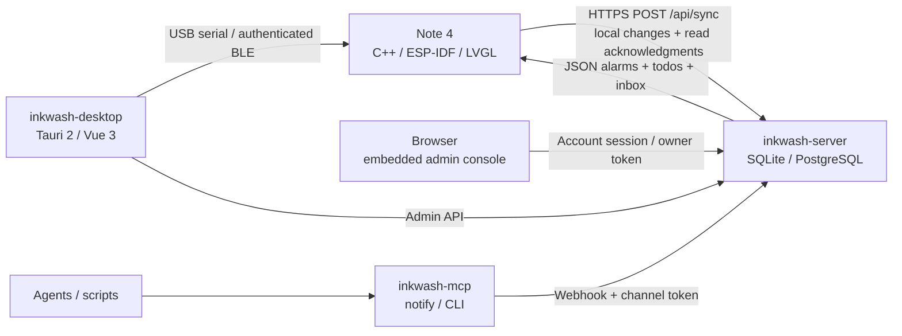

<div align="center">

# Inkwash

**A calm e-ink calendar, alarms & todos system for the Zectrix Note 4.**

Offline-first. Open source. Built for a 4.2″, 400 × 300 monochrome ESP32-S3 notebook.

[](LICENSE)
[](https://github.com/counhopig/inkwash-firmware)
[](https://github.com/counhopig/inkwash-firmware)
[](https://github.com/counhopig/inkwash-server)
[](https://github.com/counhopig/inkwash-desktop)

</div>

## Overview

Inkwash turns the Note 4 into a desk clock, calendar, alarms and todos board,
with an inbox for notifications from agents and external services. The device
renders structured content locally with LVGL and keeps it in NVS for offline use.
The PCF8563 RTC wakes the device for scheduled alarms without a network connection.

The desktop app configures the device over USB or BLE and manages content on
your own server. The server stores alarms, todos and notifications; the device
pulls them over Wi-Fi and uploads local completion, enable and read states.

## Features

- **Offline alarms** — daily, weekly, monthly and one-shot schedules, with
  RTC wake and audio reminders.
- **Calendar and todos** — month and week views, due dates, repeating todos,
  importance levels and reminders.
- **Notification inbox** — webhook messages with unread status and detail
  views; unread high-priority alerts trigger a full-screen audio reminder.
- **MCP notifications** — a `notify` tool and CLI for agents and scripts,
  with stable delivery idempotency keys and a 10-second request timeout.
- **Self-hosted backend** — SQLite or PostgreSQL, an embedded Vue admin
  console, console accounts with device ownership, an owner admin token,
  per-device sync tokens and per-channel webhook tokens.
- **USB and BLE configuration** — clock, timezone, Wi-Fi and HTTPS server
  settings, status queries and manual synchronization.
- **Cross-platform desktop app** — Tauri 2 and Vue 3 on Linux, macOS and
  Windows, plus a headless CLI for device status, sync and RTC alignment.
- **Power-aware display** — partial clock refreshes, automatic light and
  deep sleep, button and RTC wake, and boot-loop safe mode.

## Repositories

Each product lives in an independent repository. This workspace is the entry point.

| Repository | Role | Stack |
| --- | --- | --- |
| [inkwash-firmware](https://github.com/counhopig/inkwash-firmware) | Device UI, alarms, persistence, sync and USB/BLE control | C++17 · ESP-IDF 5.5.5 · LVGL 9 |
| [inkwash-server](https://github.com/counhopig/inkwash-server) | Content, device and account management, sync and webhooks | Rust · axum · SQLite/PostgreSQL · Vue 3 |
| [inkwash-desktop](https://github.com/counhopig/inkwash-desktop) | Device configuration, content management and diagnostics | Tauri 2 · Rust · Vue 3 · TypeScript |
| [inkwash-mcp](https://github.com/counhopig/inkwash-mcp) | MCP notification tool and stdio CLI | TypeScript · Bun · MCP |

## Architecture


```mermaid
flowchart LR
    D["Note 4<br/>C++ / ESP-IDF / LVGL"] -->|"HTTPS POST /api/sync<br/>local changes + read acknowledgments"| S["inkwash-server<br/>SQLite / PostgreSQL"]
    S -->|"JSON alarms + todos + inbox"| D
    T["inkwash-desktop<br/>Tauri 2 / Vue 3"] -->|"USB serial / authenticated BLE"| D
    T -->|"Admin API"| S
    U["Browser<br/>embedded admin console"] -->|"Account session / owner token"| S
    A["Agents / scripts"] --> M["inkwash-mcp<br/>notify / CLI"]
    M -->|"Webhook + channel token"| S
```

Synchronization validates server results and journals them in NVS before applying
content. Startup resumes an interrupted apply, and alarm or todo changes made
while sync runs remain pending for the next upload. Urgent polling checks for
high-priority notifications while the application is active; delivery timing
also depends on connectivity, sleep and retry state.

BLE pairing displays a passkey and times out after two minutes. USB Wi-Fi
configuration verifies connectivity before saving credentials. BLE Wi-Fi
configuration saves credentials and closes pairing; connectivity is checked by
the subsequent sync when Wi-Fi and server settings are available.

## Getting started

Clone the repositories as siblings and run each command from its own checkout.
The server and desktop need Rust and Node.js; the MCP server needs Bun.
Firmware builds require ESP-IDF **5.5.5** with the ESP32-S3 toolchain.

### Server

```sh
git clone https://github.com/counhopig/inkwash-server
cd inkwash-server
./scripts/start.sh
```

The script creates a private `.env` with an `ADMIN_TOKEN`, installs admin console
dependencies and starts the server. Open `http://localhost:8080` to create an
account or sign in as the owner and register a device. SQLite is the default;
set `DATABASE_URL` to a PostgreSQL connection URL to use PostgreSQL.

### Desktop

```sh
git clone https://github.com/counhopig/inkwash-desktop
cd inkwash-desktop
npm install
npm run tauri dev
```

Connect to the server, register a device and retain its device token. Connect the
Note 4 over USB or BLE, configure its clock, timezone, Wi-Fi, HTTPS server URL
and token, then trigger synchronization. Manage alarms, todos, channels and
inbox messages through the desktop app or browser console.

### Firmware

```sh
git clone https://github.com/counhopig/inkwash-firmware
cd inkwash-firmware
git submodule update --init firmware/components/lvgl
./scripts/build/build-cpp.sh
```

Set `IDF_PATH` for a nonstandard ESP-IDF installation. The default build output
is `firmware/build/`. On Windows, use `scripts\build\build-cpp.ps1` from
PowerShell. Follow the firmware README for board identity checks, backup and
flashing instructions.

### MCP notifications

Create a webhook channel for the device in the desktop app or server console,
and retain its one-time delivery token.

```sh
git clone https://github.com/counhopig/inkwash-mcp
cd inkwash-mcp
bun install
export INKWASH_SERVER_URL="http://127.0.0.1:8080"
export INKWASH_CHANNEL_ID="<channel-id>"
export INKWASH_WEBHOOK_TOKEN="<channel-token>"
bun run src/index.ts
```

Register that command and environment in your MCP client to use `notify`.
The CLI also accepts configuration from `~/.config/inkwash/config`:

```sh
bun run src/notify-client.ts "Deploy finished" "All services are green"
bun run src/notify-client.ts --high "Build failed" "CI needs attention"
```

## Documentation

| Topic | Source |
| --- | --- |
| Firmware build, flash, hardware and power behavior | [Firmware README](https://github.com/counhopig/inkwash-firmware#readme) |
| Device screens | [LVGL screens](https://github.com/counhopig/inkwash-firmware/blob/main/firmware/main/ui/screens.cc) |
| USB/BLE commands and replies | [Protocol codec](https://github.com/counhopig/inkwash-firmware/blob/main/firmware/main/core/protocol.cc), [USB transport](https://github.com/counhopig/inkwash-firmware/blob/main/firmware/main/control/usb_console.cc), [BLE transport](https://github.com/counhopig/inkwash-firmware/blob/main/firmware/main/control/ble.cc) |
| Device sync validation and persistence payloads | [Sync codec](https://github.com/counhopig/inkwash-firmware/blob/main/firmware/main/core/sync_payload.cc) |
| Server API, authentication and storage | [Server README](https://github.com/counhopig/inkwash-server#readme), [models and wire fixtures](https://github.com/counhopig/inkwash-server/blob/main/src/models.rs) |
| Desktop setup, CLI and logs | [Desktop README](https://github.com/counhopig/inkwash-desktop#readme) |
| MCP configuration and notification delivery | [MCP README](https://github.com/counhopig/inkwash-mcp#readme) |

## Contributing

Open issues and pull requests in the repository responsible for the change.
Keep device control and synchronization JSON compatible across firmware,
server and desktop. Firmware core tests cover hardware-free logic; device
acceptance checks cover USB, BLE, sync, alarm audio and sleep/wake behavior.

The firmware targets the monochrome Zectrix Note 4. The Note 4C has different
hardware and requires its own firmware image.

## License

[Apache-2.0](LICENSE). Firmware font licensing is documented in
[FONT_LICENSE.txt](https://github.com/counhopig/inkwash-firmware/blob/main/firmware/assets/FONT_LICENSE.txt).
